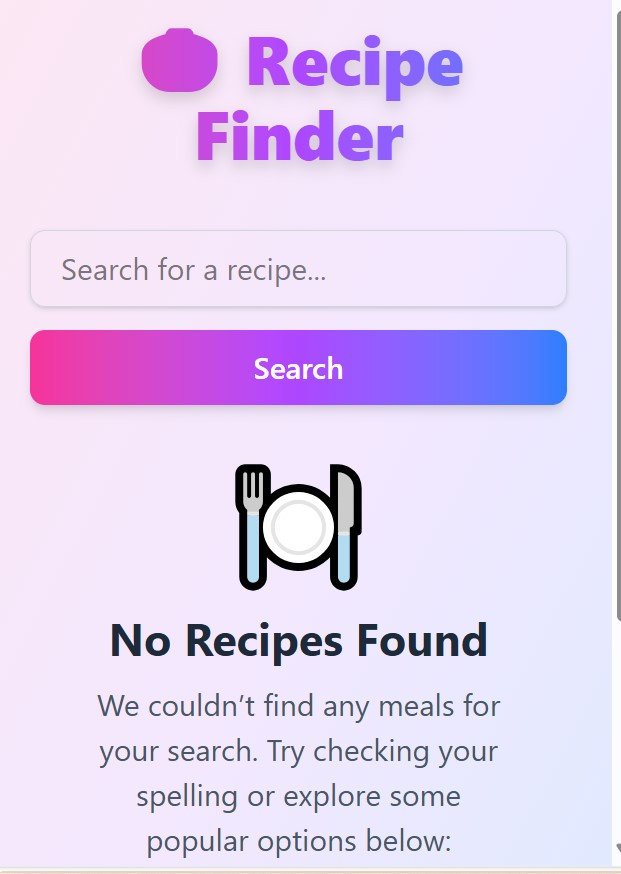

# 🍲 Kitchen Companion

A modern **Recipe Finder web application** built with **React** and powered by [TheMealDB API](https://www.themealdb.com/).  
This app allows users to **search for recipes, view detailed cooking instructions, manage favorites, and build a shopping list** — all in one place.

---

## 🚀 Features

- 🔍 **Search Recipes** — Find meals by name using TheMealDB API.
- 🖼 **Recipe Details** — View ingredients, instructions, and a meal preview image.
- ❤️ **Favorites** — Save and manage your favorite recipes (persisted in localStorage).
- 🛒 **Shopping List** — Add recipe ingredients to your shopping list for easy meal planning.
- 🎨 **Modern UI & Animations** — Smooth transitions with [Framer Motion](https://www.framer.com/motion/) and Tailwind CSS for styling.
- 📱 **Responsive Design** — Works across mobile, tablet, and desktop screens.

---

## 🛠 Tech Stack

- **React** (Frontend Framework)
- **Tailwind CSS** (Styling)
- **Framer Motion** (Animations)
- **TheMealDB API** (Recipe Data Source)
- **LocalStorage** (Favorites & Shopping List persistence)

---

## 📸 Screenshots

## Screenshots

### Home Page

### Not found

!(public/recipe-1.jpg)

## 🔧 Installation & Setup

1. Clone the repository:

https://github.com/Gentlestan/recipe-finder.git
cd recipe-finder-capstone

Install dependencies:
npm install

Start the development server:
npm run dev
